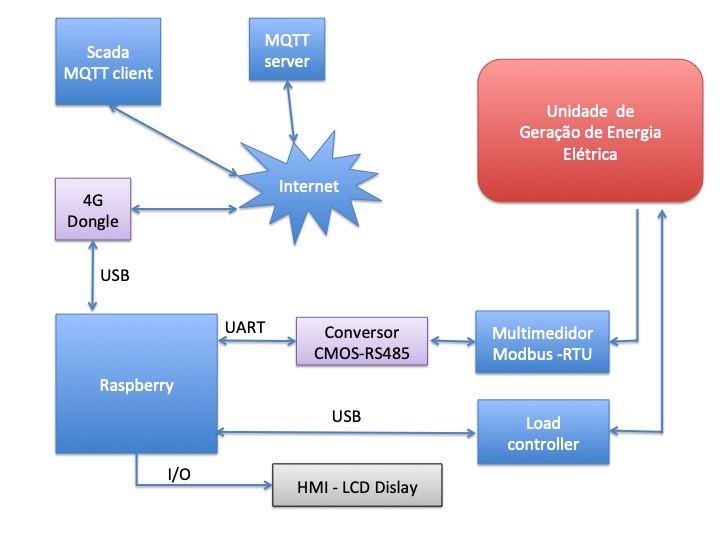
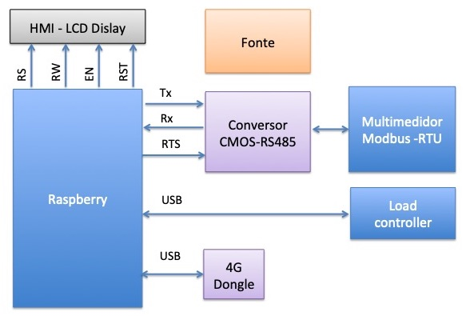
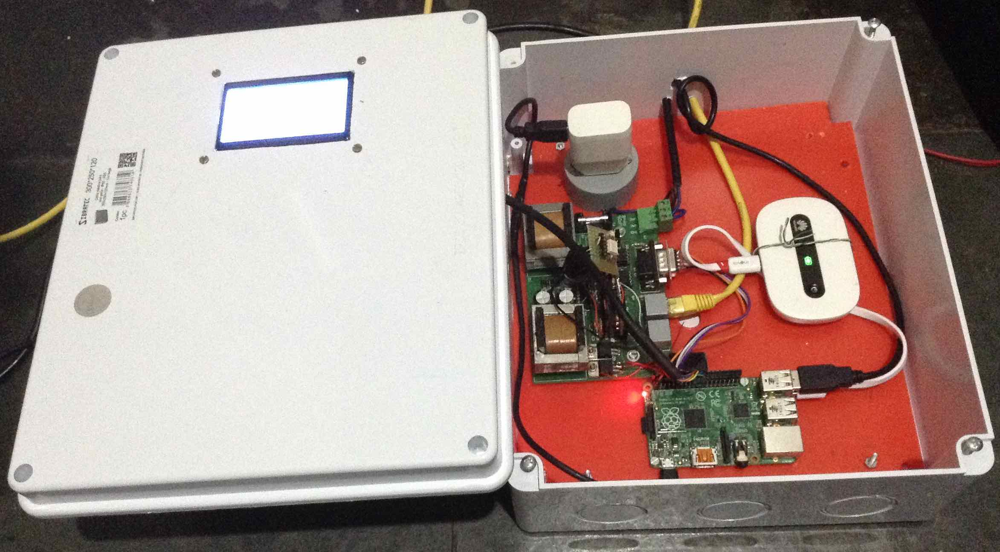
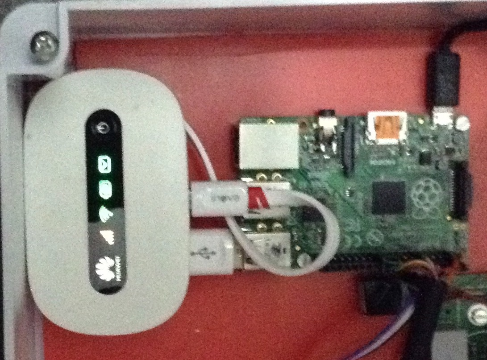
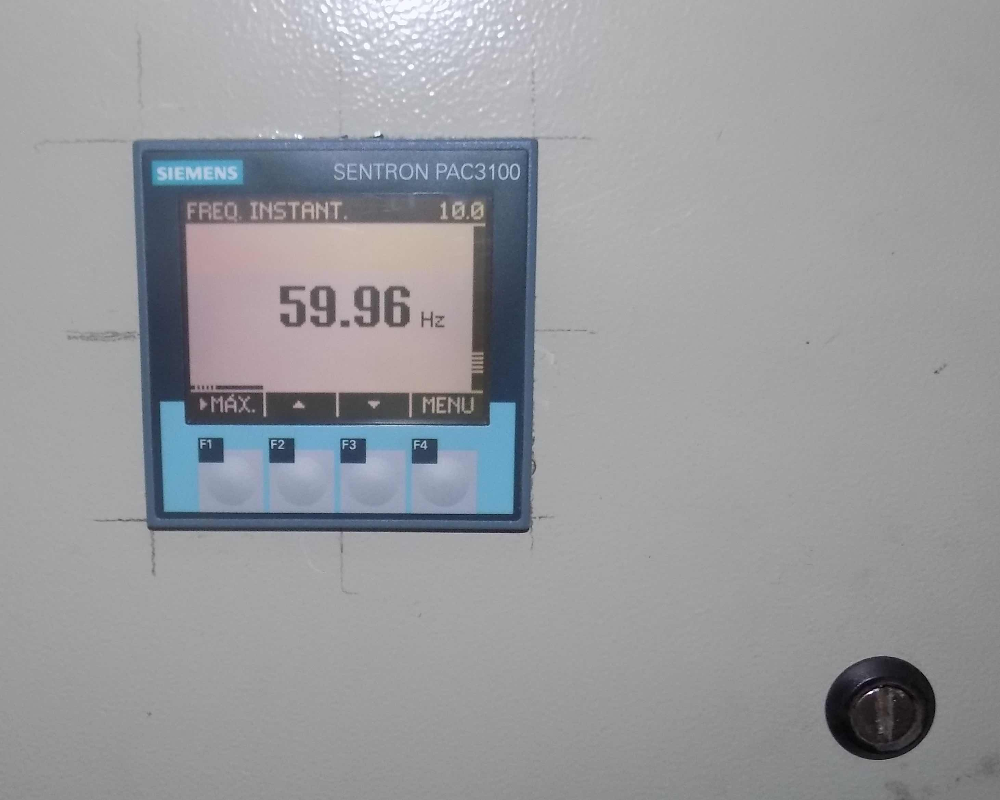
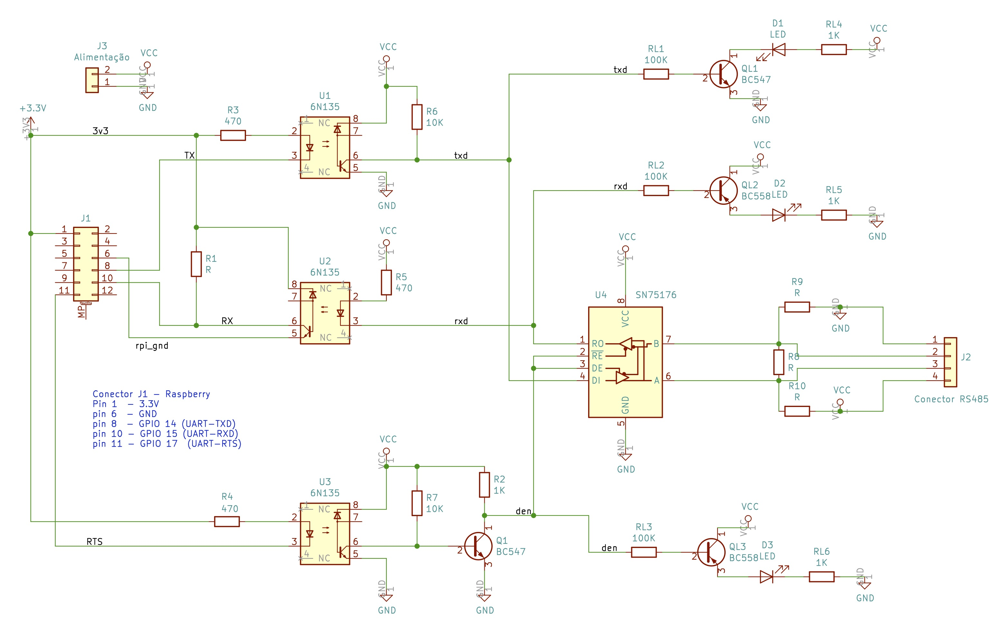
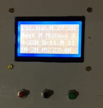

# Programa para monitorar multimedidor via MQTT
Rudivels@ 30/02/2020

Documentação em `/Users/rudi/src/Central_remota_usina/MicroHydro_Scada`

Código em `/home/pi/src/MicroHydro_Scada`

Programa para Raspberry que faça a leitura de valores elétricos um multimedidor com MODBUS-RTU e publica estes dados a cada 10 segundos via internet usando um servidor MQTT públic, além de armazena-los no próprio Raspberry.

# 1. Apresentação
Este programa faz parte de um projeto de um central de monitoramento e comando de uma micro unidade geradora de energia elétrica numa localidade remota. Este central tem que monitorar a geração de energia elétrica e sua qualidade (potência, energia, fator de potência, interrupções de fornecimento, etc), e mandar essas informações via internet para um computador central onde será intergrada num sistema *Supervisório Control and Data Aquisition (Scada)*. 

Além disso, o central tem que perimitir a configuração e/ou reprogramação remota de um controlador de carga (*load controller*) dessa micro unidade geradora de energia elétrica. Este controlador de carga é implementado num hardware dedicado com microcontrolador Arduino que controle a rede trifásico de um pico central hidrelétrico por meio de um banco de triacs. 
ainda será detalhada em repostório próprio. 
Os detalhes dessa implementação esão no repositório <https://github.com/rudivels/Controlador_carga_3fas>.


Escolheu-se implementar o hardware do central com o Raspberry rodando raspbian (linux debian para Raspberry). O diagrama de bloco de todo o sistema é mostrada no figura a seguir.  





Neste trabalho será detalhada a implementação do protocolo Modbus-RTU no Raspberry e a comunicação via MQTT com o Scada no computador de monitoramento.


# 2. Implementação 

O hardware usado na implementação tem os seguintes componentes:
- Raspberry Pi com Raspbian
- USB 4G Dongle
- Multimedior Sentron com interface RS485
- Conversor TTL RS485 half-duplex

O diagrama de blocos do hardware é mostrada na figura a seguir.




Um foto do hardware montado com o Raspberry, Conversor RS485, 4G Dongle e Display é mostrada a seguir.





## 2.1. Raspberry Pi 

A primeira versão foi implementado com um raspberry Pi Model B+ V1.2 

A conexão do Raspberry com os periféricos está na tabela a seguir.


| Raspberry | WiringPi | Interface | Função | pino |              
|:---------:|:--------:|:---------:|:------:|:----:|
|     1     | 3v3      |  RS485    |        |      | 
|     2     | 5 volts  |  RS485    |        |      |    
|     2     | 5 volts  |  LCD      |  Vdd   |  2   |   
|     2     | 5 volts  |  LCD      |  Vo    |  3   |
|     2     | 5 volts  |  LCD      |  BLA   | 19   | 
|     6     | GND      |  RS485    |        |      |
|     8     | xx TXD   |  RS485    |  TX    |
|    10     | xx RXD   |  RS485    |  RX    |
|    11     | xx RTS   |  RS485    | RTS    |
|    19     | 12       |  LCD      |  RW    |  5   | 
|    20     | GND      |  LCD      |  Vss   |  1   |                  
|    20     | GND      |  LCD      |  BLK   | 20   |    
|    22     |  6       |  LCD      |  RST   | 17   |
|    23     | 14       |  LCD      |  EN    |  6   |
|    24     | 10       |  LCD      |  RS    |  4   |


Os detalhes da interface com display LCD com o Raspberry estão disponíveis no repositório <https://github.com/rudivels/st7920>. 

Conector do Raspberry PI com as ligações para o LCD e RS485 segue a tabela a seguir.


| conec | pin | pin | conec |
|-------|:---:|:---:|-------|
| 3.3.v |  1  |  2  |  5 V  | 
|       |  3  |  4  |       |
|       |  5  |  6  |       |
|       |  7  |  8  |  TX   |
|       |  9  | 10  |  RX   |
|  RTS  | 11  | 12  |       |
|       | 13  | 14  |       |
|       | 15  | 16  |       |
|       | 17  | 18  |       |
|  RW   | 19  | 20  | GND   |
|       | 21  | 22  | RST   |
|  EN   | 23  | 24  | RS    |
|       | 25  | 26  |       |


## 2.2. WIFI 

### 2.2.1 USB 4G Dongle

A comunicação entre o Raspberry com a internet é por meio de um modem roteador WiFi conforme mostrada na figura a seguir.



A vantagem de usar este dispositivo é que além de permitir a ligação direta do Raspberry via USB, ele também permite o acesso outros computadores via SSH ou FTP ao Raspberry por meio da sua rede local WiFi. Assim o trabalho de configuração e manutenção em campo se torna mais prática. 
As funcionalidades de envio de mensagens SMS também pode ser explorado no futuro para envio de alarmes. 

### 2.2.2 Raspberry Pi Zero (08/09/2020)

A segunda versão do sistema foi implementado por meio de Raspberry Zero e isso trouxe alguns ajustes na configuração do sistema que não eram necessários no Raspberry Pi model B+.

A primeira mudança foi a porta serial dafault do Raspberry pi Zero de ttyS0 para o ttyAMA.

Os procedimentos para mudar a porta serial para ttyAMA0 consiste em adicionar um `device tree` para o arquivo `/boot/config.txt` para dishablitar o módulo de bluetooth.
Isso pode ser feito pelos seguintes comandos

``sudo nano /boot/config.txt``

E coloca no fim deste arquivo a seguinte instrução.

``dtoverlay=pi3-miniuart-bt``


Outro problema encontrado é o fato do Raspberry Zero depois de alguns minutos perde a rede wifi. Isso foi resolvido com o desligamento da gerenciamento de potência do wifi. O comando usado para fazer isso foi:

``wiconfig wlan0 power off`` 

Outra pendência ainda não resolvido no Raspberry Zero é a necessidade iniciar a porta serial com o controle RTS/CTS sem estar logado como superusário. Por enquanto é necessária manualmente fazer essa operação como superusuário:

``rpirtscts on ``


## 2.3. Multimedidor

A monitiração dos paramtros elétricos é realizado por um multimedior industrial ligado ao centrel por meio do protocolo de comunicação Modbus-RTU. 

Descrição do multimedidor e do protocolo Modbus. Veja a diferença entre modbus RTU e modbus IP.

A figura a seguir mostra uma foto deste equipamento.



Foi necessário configurar o Multimedidor
 
```
endereço escolhido = 1
baudrate = 19200 bps
tempo de resposta = 50ms
```
O tempo de resposta é necessário para sincronizar a leitura do controlador. 
O protocolo Modbus prevê um tempo de resposta mínima que depende a velocidade do protocolo.


## 2.4. Conversor RS485 half-duplex
Há diversas maneiras de implementar o conversor RS485 para o Raspberry. Uma maneira é por meio de um conversor USB/RS485 que implementa toda funcionalidade do UART e a comunicação half duplex no próprio conversor. 
No nosso caso resolvemos usar a própria UART disponível no barramento de expansão do Raspberry. Os pinos 8,10 no barramento de expansão podem ser configurados para recepção RX e transmissão TX respectivamente da porta serial /dev/ttyAMA0. Como os níveis da tensão neste barramento são CMOS 3.3v é necessária um conversor CMOS/TTL/RS485. O esquematico eletrônico desse conversor é mostrada na figura a seguir.




Para implementar a comunicação half-duplex é necessária usar mais um pino de saída do barramento de expansão do Raspberry para comandar o sentido do canal de comunicação.
A implementação deste comando se mostrou um pouco sensível, pois tem que se levar em consideração a velocidade de transmissão de dados a capacidade de resposta do multimedidor.
As bibliotecas tradicionais que implementam a comunicação serial no Linux não são muito claros de como é implementado o controle de fluxo (RTS, CTS, DTR, DSR e DCD) do UART. 
É comum usar o sinal de RTS (pino 11 da barramento de expansão) para fazer o controle de fluxo em sistemas de comunicação half-duplex.  
Quando a comunicação serial é de muito baixa velocidade (por exemplo 1200 bps) poderia se fazer o controle de fluxo controlando diratemente o sinal RTS do programa principal. 
No nosso caso, com a comunicação de 19200 bps é preciso que o controle de fluxo seja feito diretamente pelo Driver da porta UART. Foi necessário então instalar um driver adicional no Linux para implementar a função de comutação de canal pelo sinal RTS. 

 
# 3. Implementação do programa
A diretriz na implementação do software foi de aproveitar ao máximo as funcionalidades próprios de sistema operacional linux e elaborar pequenos programas modulares em linguagens apropriada para cada tarefa específica. 
Por exemplo, se a necessidade é velocidade, tamanho e acesso a um hardware específico, a escolha será implementação com lnguagens compiladas. Quando se precisa de flexibilidade para alterar parametros e muita funcionalidade complexa, a opção é usar scripts e linguagens interpretados que tenham bibliotecas bastante consolidados e confiáveis. 

O sistema é implementado por meio de 4 rotinas ou programas listas a seguir:

- 3.1. Programa monitor que verifica a situação do link TCP/IP, MODBUS-RTU, MQTT e apresenta uma interface para o usuario por meio de LCD e teclas para diagnóstico e comando.
- 3.2. Rotina de leitura de dados do multimedidor por meio de MODBUS-RTU implementado em Python;
- 3.3. Rotina para publicar os dados via MQTT em Pyhton;
- 3.4. Script em bash que temporiza a chamada à rotina para publicar dados via MQTT;
- 3.5. Cron para carregar o script e o progaram Monitor na inicialização do Linux;

Antes de rodar os programa tem que configurar o Raspberry para que habiliar a porta serial. Isso pode ser feito com o comando:
```
$ raspi-config
```

Outra preocupação é garantir a habilitação para que o módulo serial do Python consegue trabalhar no modo half-duplex. Isso é feito pela instalação do programa do rpirtsrtc disponível no <https://github.com/mholling/rpirtscts> num diretório de trabalho no Raspberry.
```
$ /home/pi/bin/rpirtscts on
```


## 3.1. Progama Monitor
Este programa permite que o usuário por meio de LCD e teclas, tenha condições de fazer algumas operações simples, como por exemplo verificar o estado das interfaces de comunicação, testar algum enlace etc. 
São comandos simples executado por meio dos botões. 
Este monitor se mostrou necessário, para poder fazer diagnosticos rápidos sem precisar do uso de um computador ligado no raspberry via terminal `ssh`.

A figura abaixo mostra a tela do monitor e as suas teclas de operação.




O programa Monitor que apresenta os pricipais dados no LCD.

- Estado do link TCP/IP, mostrando o endereço IP da máquina
- Estado do link MODBUS-RTU
- Estado do link MQTT (falta implementar)
- Tensão da bateria de nobreak
- Tensão da rede AC
- Horário 


O programa está no diretório `/home/pi/src/Monitor_IP_LCD` e também usa rotinas de leitura de tensão de bateria e rede elétrica com o [conversor analógico digital para o Raspberry](https://github.com/rudivels/RaspberryPi_Adc)

Este programa é a interface com o usuário permite o que o usuária possa tomar certas decisões em casos de malfuncionamento, falha na comunicação ou falha numa suboritina.

Numa proxima versão vai ser preciso implementar algumas rotinas de configuração geral do software por meio deste monitor, como por exemplo, mudar o endereço do MODBUS-RTU ou mudar de rede WiFi.

## 3.2. Rotina em Python para ler os dados do multimedidor

Descrição do protocolo Modbus-RTU.  
Endereço, tipos de registradores e sua implementação no minimalmodbus em python


Nome do arquivo é `modmedidor.py` 

A implementa o protocolo MODBUS-RTU para fazer a leitura dos valores do medidor.

O nome da porta serial e o endereço do medidor está codificado diretamente na rotina. O nome da porta é "/dev/ttyAMA0" e o endereço é 1.

O parametro de entrada é o endereço da variavel a ser lido no multimedidor e o valor de retorno é o valor da variável.

Rotina para ler um registro do medidor pelo protocolo Modbus

```
import serial.rs485
import minimalmodbus

def leia(reg) :
    ser=serial.rs485.RS485("/dev/ttyAMA0",19200)
    ser.rs485_mode = serial.rs485.RS485Settings()
    ser.rs485_mode.rts_level_for_tx=False # True
    ser.rs485_mode.rts_level_for_rx=True # False
    ser.timeout=0.7
    m = minimalmodbus.Instrument(ser.port,1)
    m.serial=ser
    m.debug=False
    try:
        valor=m.read_float(reg,3,2)
        m.serial.close()        
        return(valor)
    except IOError:
        print("# Failed to read from instrument")
        m.serial.close()
        return(0)
```
Essa rotina lê o registro repassado pelo argumento da função endereço 1 do Modbus porta serial 
 
## 3.3. Rotina para publicar os dados

Descrição do protocolo MQTT.
 
Conceito de tópico.

Descrever os diversos níveis do tópico.

Falta atualizar usando o exemplo do <https://www.embarcados.com.br/mqtt-protocolos-para-iot/>


### 3.3.1 Versão simples

Essa versão é bem simples e junta todos os valores dos sensores num único string e manda para o broker.

O que limita essa versão é que nao verifica se o link com o Broker está ativa e recebendo. Ele monta o pacote e manda para o broker...

Nome do arquivo no Raspberry é 
`/home/pi/scr/MicroHydro_Scada/publish_microhydro_002.py`

O parametros de entrada é o nome do logfile que armazena os dados locais.

A rotina implementa o protocolo cliente MQTT e o endereco do servidor MQTT é  <http://mqtt.eclipse.org> usando a porta 1883 e o topic é  ChapHydro.

Rotina que leia os registradores do multimedidor, monta um string e publica este string por meio de MQTT.

```
# leia frequencia , tensao , corrente, fatorpotencia
frequencia = round(mod_medidor.leia(39),1)  # frequencia
tensao_A =   round(mod_medidor.leia(1),1)   # tensao 1
tensao_B =   round(mod_medidor.leia(3),1)   # tensao 2
tensao_C =   round(mod_medidor.leia(5),1)   # tensao 2
 
corrente_A  =   round(mod_medidor.leia(13),1)   # corrente 1
corrente_B  =   round(mod_medidor.leia(15),1)   # corrente 2
corrente_C  =   round(mod_medidor.leia(17),1)   # corrente 3

pot_ativa_A =   round(mod_medidor.leia(25),1)   # potencia 1
pot_ativa_B =   round(mod_medidor.leia(27),1)   # potencia 2
pot_ativa_C =   round(mod_medidor.leia(29),1)   # potencia 3

fator_pot   =   round(mod_medidor.leia(53),1)   # fator potencia

s = str(agora)+";"+str(frequencia)+";"+ str(tensao_A)+";"+str(tensao_B)+";"+str(corrente_A)+";"+str(corrente_B)+";"+str(corrente_C)+";"+str(pot_ativa_A)+";"+str(pot_ativa_B)+";"+str(pot_ativa_B)+";"+str(fator_pot)
publish.single("Topico", s ,hostname="mqtt.eclipse.org")
```
Os dados medidos são mandados para o broker mais também são armazenados num arquivo texto local. Dessa forma tem sempre uma cópia dos ultiimos dados gravados em disco.

Para garantir a integridade dos dados escolheu-se a opção de depois de cada operação de varredura do MODBUS e publicação dos dados com MQTT fechar todas as portas e arquivos.  

Se o cliente Modbus estiver fora, uma mensagem é gravada no arquivo local dizendo que não tem comunicação com cliente Modbus com o *timestamp*

Se o servidor Scada ficar desligado durante algum tempo ainda temos os dados armazenados localmente. Entretanto o programa ainda não verifique isso. Deveria ter uma maneira de fazer o upload destes dados para o Scada quando voltar.


## 3.4. Script para temporizar
Nome do arquivo <loop_publish.sh>

O script em bash foi a opção encontrada para chamar a rotina em Python e temporizar a publicação dos dados.
 
Para permitir a execução deste programa em background dessamarrado de um terminal aberto Raspberry, usa-se a seguinte comando:

```
nohup ./loop_publish.sh  & > /dev/null &
```


## 3.5. Cron para carregar o programa na inicialização

O programa para configurar o cron é o 
```
$ crontab -e
```
Também pode-se editar o arquivo de configuração do cron diretamente. Nas ultimas linhas do arquivo adiciona os seguintes comandos.

```
@reboot /home/pi/bin/rpirtscts on
@reboot nohup /home/pi/src/MicroHydro_Scada/loop_publish.sh  & > /dev/null &
```


# 4. Atualização remota do algoritmo de controle

Inotools

Acesso remoto à computador com IP dinâmico via Dataplicity


