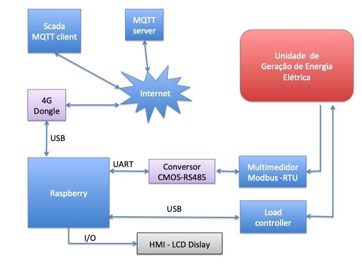
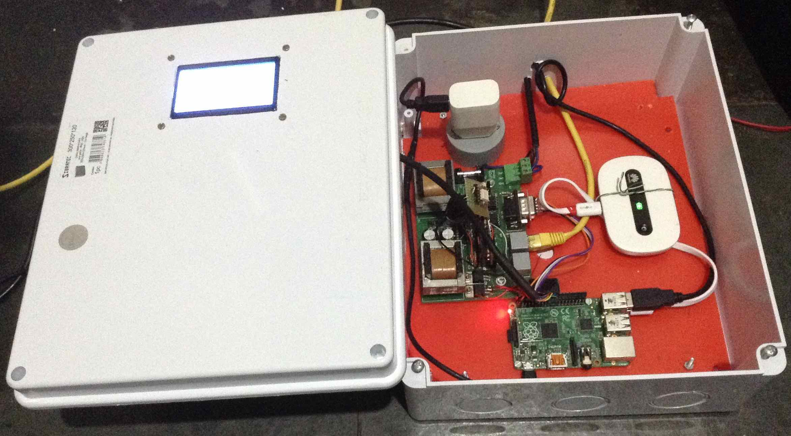
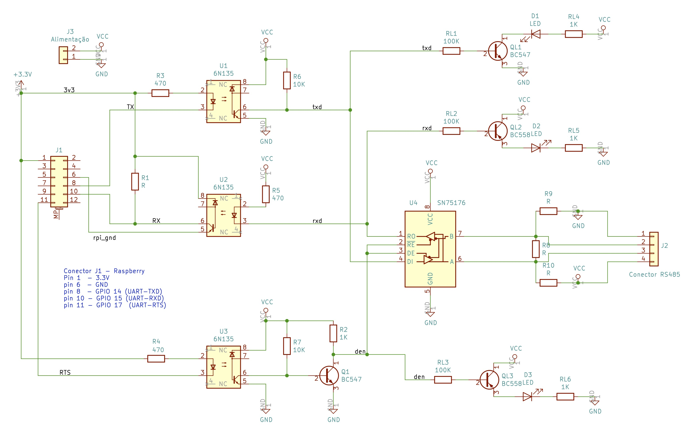

# Programa para monitorar multimedidor via MQTT
Rudivels@ 30/02/2020

Programa para Raspberry que faça a leitura de valores elétricos um multimedidor com MODBUS-RTU e publica estes dados a cada 10 segundos via internet usando um servidor MQTT públic, além de armazena-los no próprio Raspberry.

## Apresentação
Este programa faz parte de um projeto de um central de monitoramento e comando de uma micro unidade geradora de energia elétrica numa localidade remota. Este central tem que monitorar a geração de energia elétrica e sua qualidade (potência, energia, fator de potência, interrupções de fornecimento, etc), e mandar essas informações via internet para um computador central onde será intergrada num sistema Supervisório Control and Data Aquisition (Scada).

Além disso, o central tem que perimitir a configuração e/ou reprogramação remota de um controlador de carga dessa micro unidade geradora de energia elétrica. O controlador de carga é implementado num microcontrolador Arduino que será documentado em outro repositório no meu github. 

Escolheu-se implementar o hardware do central com o Raspberry rodando raspbian (linux debian para Raspberry). O diagrama de bloco do sistema é mostrada no figura a seguir.  




Um foto do hardware montado com o Raspberry, Conversor RS485, 4G Dongle e Display a mostrada a seguir.




.


Este respositário detalhará a implementação do protocolo Modbus-RTU no Arduino, e a comunicação via MQTT a computador de monitoramento.
Os detalhes do controlador de carga e interface com display serão registrados em outro repositório git.


## Hardware
- Raspberry Pi com Raspbian
- USB 4G Dongle
- Multimedior Sentron com interface RS485

- Conversor TTL RS485 half-duplex

Há diversas maneiras de implementar o conversor RS485 para o Raspberry. Uma maneira é por meio de um conversor USB/RS485 que implementa toda funcionalidade do UART e a comunicação half duplex no próprio conversor. 
No nosso caso resolvemos usar a própria UART disponível no barramento de expansão do Raspberry. Os pinos 8,10 no barramento de expansão podem ser configurados para recepção RX e transmissão TX respectivamente da porta serial /dev/ttyAMA0. Como os níveis da tensão neste barramento são CMOS 3.3v é necessária um conversor CMOS/TTL/RS485. O esquematico eletrônico desse conversor é mostrada na figura a seguir.



.

Para implementar a comunicação half-duplex é necessária usar mais um pino de saída do barramento de expansão do Raspberry para comandar o sentido do canal de comunicação.
A implementação deste comando se mostrou um pouco sensível, pois tem que se levar em consideração a velocidade de transmissão de dados a capacidade de resposta do multimedidor.
As bibliotecas tradicionais que implementam a comunicação serial no Linux não são muito claros de como é implementado o controle de fluxo (RTS, CTS, DTR, DSR e DCD) do UART. 
É comum usar o sinal de RTS (pino 11 da barramento de expansão) para fazer o controle de fluxo em sistemas de comunicação half-duplex.  
Quando a comunicação serial é de muito baixa velocidade (por exemplo 1200 bps) poderia se fazer o controle de fluxo controlando diratemente o sinal RTS do programa principal. 
No nosso caso, com a comunicação de 19200 bps é preciso que o controle de fluxo seja feito diretamente pelo Driver da porta UART. Foi necessário então instalar um driver adicional no Linux para implementar a função de comutação de canal pelo sinal RTS. 

 
## Software
- Rotina em Python para ler os dados do multimedidor
- Rotina em Pyhton para publicar os dados
- Script em bash que temporiza o envio
- Cron para carregar o programa na inicialização

Antes de rodar os programa tem que configurar o Raspberry para que habiliar a porta serial. Isso pode ser feito com o comando:
```
$ raspi-config
```
Outra preocupação é garantir a habilitação para que o módulo serial do Python consegue trabalhar no modo half-duplex. Isso é feito pela instalação do programa do rpirtsrtc disponível no <https://github.com/mholling/rpirtscts> num diretório de trabalho no Raspberry.
```
$ /home/pi/bin/rpirtscts on
```

### Rotina em Python para ler os dados do multimedidor


Nome do arquivo é <modmedidor.py> e implementa o protocolo MODBUS-RTU para fazer a leitura dos valores do medidor.

O nome da porta serial e o endereço do medidor está codificado diretamente na rotina. O nome da porta é "/dev/ttyAMA0" e o endereço é 1.

O parametro de entrada é o endereço da variavel a ser lido no multimedidor e o valor de retorno é o valor da variável.
 
### Rotina para publicar os dados
Nome do arquivo <publish_microhydro_002.py>

O parametros de entrada é o nome do logfile que armazena os dados locais.

A rotina implementa o protocolo cliente MQTT e o endereco do servidor MQTT é  <http://mqtt.eclipse.org> usando a porta 1883 e o topic é  ChapHydro.

Para garantir a integridade dos dados escolheu-se a opção de depois de cada operação de varredura do MODBUS e publicação dos dados com MQTT fechar todas as portas e arquivos.  

### Script para temporizar
Nome do arquivo <loop_publish.sh>

O script em bash foi a opção encontrada para chamar a rotina em Python e temporizar a publicação dos dados.
 
Para permitir a execução deste programa em background dessamarrado de um terminal aberto Raspberry, usa-se a seguinte comando:

```
nohup ./loop_publish.sh  & > /dev/null &
```

### Cron para carregar o programa na inicialização

O programa para configurar o cron é o 
```
$ crontab -e
```
Também pode-se editar o arquivo de configuração do cron diretamente. Nas ultimas linhas do arquivo adiciona os seguintes comandos.
```
@reboot /home/pi/bin/rpirtscts on
@reboot nohup /home/pi/src/MicroHydro_Scada/loop_publish.sh  & > /dev/null &
```

